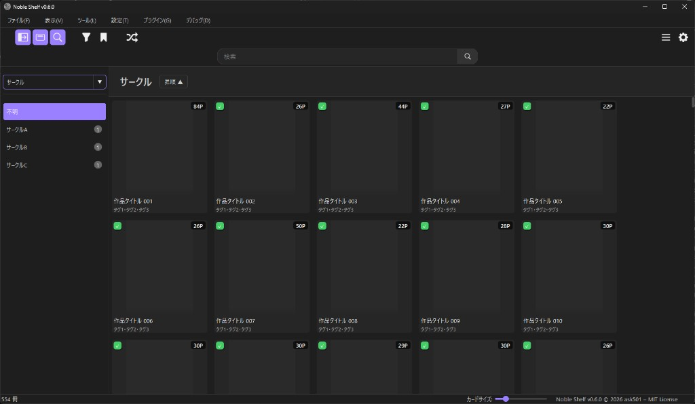

**公式サイト（紹介・更新履歴など）:** [Noble Shelf - ローカル同人誌ライブラリ管理ツール](https://ask501.github.io/Noble_Shelf/)

# Noble Shelf

**パソコンに入っている同人誌や電子書籍を、Windows 上で一覧・検索・読書までまとめて扱うアプリです。** 指定したフォルダの中を読み取り、表紙付きの一覧（グリッド）を作ります。ZIP や PDF、画像だけのフォルダも、アプリの中でそのまま開いて読めます。

**こんな人向け:** 今のフォルダの並びをできるだけ変えずに棚として使いたい／**ダウンロード販売などで入手した、専用の拡張子のファイル**もほかの本と同じ一覧に載せたい／**ブラウザで見ているページの情報を、作品の名前やメモに反映したい**、といった使い方を想定しています。

### 主な特長

- **本のファイルは今ある場所のままでよい**（別の場所へ移し替えたり、このアプリ専用の形式に閉じ込めたりはしません）
- **ZIP・PDF・画像フォルダは、アプリの中で開いて読める**（一覧からクリックするだけ）
- **ブラウザで表示中のページ情報を取り込める（手動操作）**（ブックマークレットやプラグイン。閲覧中の画面を補助するイメージで、タイトルやサークル名などを作品に載せる用途）

画面の操作と、作品リストの記録（検索しやすくするためのデータ）を **ひとつのアプリ** にまとめています。

### スクリーンショット

SNS やブログ用に画面を載せたいときは、**デバッグメニューの「ダミーモード」** をオンにすると、作品名・表紙・タグの表示などが仮の文字・仮の画像に切り替わります（中身のファイルや登録データは書き換えません）。



その他の画面例は [公式サイト](https://ask501.github.io/Noble_Shelf/) を参照してください。

### クイックスタート

1. **入手** … [GitHub のこのページ](https://github.com/ask501/Noble_Shelf) からソースを取得するか、[Releases](https://github.com/ask501/Noble_Shelf/releases) にある配布版をダウンロードして展開します。
2. **起動** … ソースから動かす場合は `python launcher.py`（更新の確認あり）または `python main.py` を実行します。
3. **本の入っているフォルダを教える** … メニュー **「ファイル」→「ライブラリフォルダを設定」** で、そのフォルダを選びます。
4. **あとは待つ** … 一度読み込むと、一覧に作品が並びます。ダブルクリックなどでアプリ内の読書画面を開いたり、右クリックで名前の変更などができます。

追加で必要なプログラム（ライブラリ）の入れ方や、実行ファイル（.exe）の作り方、困ったときは下の **[使い方](#使い方)** を見てください。

---

**開発者向けの技術メモ:** 言語は Python 3.14 想定、画面まわりは PySide6 です。フォルダのスキャン、表紙つき一覧、検索・並べ替え・絞り込み、星評価、作品情報の編集、アプリ内ビューワー、一部の専用拡張子ファイル向けの外部ビューワー起動、データのバックアップなどを一つの構成で扱います。

---

## 主な機能

利用者向けに言い換えると、だいたい次のようなことができます（括弧内はソース上の場所の目安です）。

- **ライブラリ** … 指定フォルダの中身を読み取り、作品リストを作る（データは `library.db` に保存）
- **一覧画面** … 表紙・タイトル・サークル名・ページ数などをカード状に表示（`grid/`）
- **検索・並べ替え・絞り込み** … 文字で探す、条件で絞る、並び順を変える（`filter_popover.py` など）
- **アプリ内で読む**（`ui/dialogs/viewer/`）  
  - 1 ページ／見開き、ページ送り、下のサムネ一覧、全画面の目次風表示 など  
  - PDF・ZIP などの圧縮ファイル・画像フォルダに対応（`BookReader` 系）
- **専用拡張子のファイル** … `.dmm*` / `.dlst` など、形式ごとに用意されたビューワーで開く（アプリ内ビューワーとは別）
- **表紙画像** … 自動で探したり、差し替えたり（`cover_paths.py` とキャッシュ）
- **作品の情報を編集** … タイトルやサークル、カバーなど（`ui/dialogs/properties/`）
- **右クリックメニュー** … 開く・削除・ブックマークなど（`context_menu/`）
- **プラグイン** … 追加で検索や情報取得の機能を足せる（`plugin_loader.py`）
- **ドラッグ＆ドロップ** … ファイルやフォルダを窓に落として登録（`drop_handler.py`）
- **バックアップ** … 一覧データの保存・復元（設定画面・`db.py`）
- **更新チェック** … `launcher.py` から GitHub の新しい版を確認（`updater.py`）
- **ブックマークレット** … ユーザーが手動で実行し、表示中のページからアプリへ情報を送る閲覧補助（`local_server.py`・`bookmarklet/`）
- **その他の窓** … はじめての案内、フォルダの整理、表紙が重複している本の確認など（`library_*` など）

---

## 対応形式（概要）

| 種別 | 拡張子 | 備考 |
|------|--------|------|
| **圧縮ファイル（ZIP など）** | `.zip`, `.cbz`, `.7z`, `.cb7`, `.rar`, `.cbr` | アプリ内で開いて読める。ページ数も数えられる。細かい対応拡張子は `config` 参照 |
| **PDF** | `.pdf` | アプリ内で開ける。表紙用の画像は `cover_cache` に保存されることがある |
| **フォルダ** | （フォルダ単位） | 中身が画像だけ、または PDF が 1 枚だけ、などとして登録 |
| **専用形式（拡張子の例）** | `.dmmb`, `.dmme`, `.dmmr` | その形式向けのビューワーで開く |
| **専用形式（拡張子の例）** | `.dlst` | その形式向けのビューワーで開く |

画面の余白や細かい設定値は `config.py` にまとめてあります。

---

## プロジェクト構成（主要ファイル）

開発者向けです。どのファイルが何をしているかの目安です。

```
（リポジトリルート）/
├── launcher.py              # 起動：クリーンアップ → 更新確認 → main.main()
├── main.py                  # QApplication・フォント・テーマ・MainWindow 表示のみ
├── app.py                   # メインウィンドウ。レイアウト・スキャン・D&D・シグナル統合
├── version.py               # アプリバージョン
├── config.py                # 定数（フォント、ビューア UI、グリッド、拡張子 等）
├── paths.py                 # APP_BASE、DB、キャッシュ、プラグイン、アイコン SVG パス
├── theme.py                 # QSS・カラー定数・ダークタイトルバー補助
├── db.py                    # SQLite・マイグレーション・バックアップ
├── cover_paths.py           # カバー画像パス解決
├── book_updater.py          # 作品名・メタ更新の共通処理
├── store_file_resolver.py   # ストアファイルの重複・リネーム判定
├── drop_handler.py          # D&D 登録
├── cache.py                 # キャッシュ補助
├── debug_tools.py           # 開発用
├── updater.py               # GitHub Releases 更新
├── local_server.py          # ブックマークレット用 HTTP（127.0.0.1）
├── plugin_loader.py         # プラグイン読み込み・有効フラグ
├── scanners/                # scan_library()、book スキャン（`book_scanner.py` 等）
├── grid/                    # グリッド（view / model / delegate / thumb / roles）
├── context_menu/            # 右クリックメニュー・アクション分割
├── bookmarklet/             # JS・閲覧補助（ページ構造に応じたパーサ）
├── ui/
│   ├── widgets/             # メニューバー、ツールバー、サイドバー、検索バー、ステータスバー、トースト
│   ├── dialogs/
│   │   ├── viewer/          # 内置ビューワー（Viewer・キャンバス・オーバーレイ・ストリップ・Reader）
│   │   ├── properties/      # プロパティ・リネーム・メタ検索 / 適用
│   │   ├── settings/        # 設定タブ（一般・ショートカット・バックアップ・カード）
│   │   ├── filter_popover.py
│   │   ├── bookmarklet_window.py / bookmarklet_help_dialog.py
│   │   ├── library_folder_dialog.py / first_run.py
│   │   ├── duplicate_cover_dialog.py / missing_books_dialog.py
│   │   ├── library_organize_dialog.py / library_init_confirm_dialog.py
│   │   ├── library_check_dialog.py / library_checker.py
│   │   └── thumbnail_crop_dialog.py
│   └── utils/               # 自動スクロール等
├── tests/                   # スキャナ・リゾルバ等のテスト
├── scripts/                 # 例: fix_uuid_mismatch.py
├── assets/                  # アイコン・バッジ・ビューア用 SVG（paths.py の定数と対応）
└── docs/                    # ドキュメント用静的ファイル

ユーザーデータ（既定）: %APPDATA%\NobleShelf\
├── library.db
├── backups/
├── thumb_cache/ / cover_cache/
└── plugins/
```

ビューワーをコードから使うときは **`from ui.dialogs.viewer import Viewer`** を参照してください。昔の 1 ファイル版の退避用（`*_old.py` / `*.bak`）は手元にだけ残す場合がありますが、**GitHub に上がっている中身には含めていません**。

---

## プラグイン

機能を足すための拡張です。普段の利用では、メニューでオン・オフするだけで十分なことが多いです。中身を入れる場所と、作る人向けの約束ごとは次のとおりです。

- **置き場所:** **`%APPDATA%\NobleShelf\plugins\`** の中に、フォルダを 1 つずつ作る（そのフォルダに `__init__.py` があると 1 個のプラグイン）。メニュー「プラグイン → プラグインフォルダを開く」で開けます。配布用 Zip には最初から入れていません。
- **プラグイン側で用意する名前や関数**（`__init__.py`）: 最低限 `PLUGIN_NAME`, `PLUGIN_SOURCE_KEY`, `search_sync`, `get_metadata_sync`。必要に応じて `can_handle(...)` など。
- **オン・オフ:** 設定がデータベースに `"1"` / `"0"` で保存されます。未設定のプラグインは「オン」とみなします。
- **プログラムから取り出すとき:** `get_plugins()` は有効なものだけ、`get_all_plugins()` は一覧用です。

---

## 使い方

### 要件

- **OS:** Windows（タイトルバーを暗くするなど、Windows 向けの見た目調整あり）
- **Python:** 3.14 想定で開発
- **依存:** `PySide6`, `PyMuPDF`（`fitz`）, `Pillow`, `py7zr`, `rarfile`, `beautifulsoup4`, `Send2Trash` 等（`requirements.txt` がない場合は個別に `pip install`）

### 起動

- **`python launcher.py`（推奨）** … クリーンアップおよび更新確認を含みます。
- **`python main.py`** … メインウィンドウのみ起動します。

初回は「どのフォルダに本があるか」がまだ決まっていないことがあります。その場合は画面の案内からフォルダを選び、読み込み（スキャン）を実行します。

### メンテナンス

- `python scripts/fix_uuid_mismatch.py` … フォルダに付いている ID と、一覧データの ID が食い違ったときの直し方（画面の質問に答えながら進みます）。

### exe 化

- `BUILD.bat` … 1 本の .exe にまとめるための例（PyInstaller を使う想定）。アイコンなどの `assets` も一緒に入れる設定になっています。

---

## ブックマークレット連携

**閲覧の補助**として、ユーザー自身がブラウザで開いているページから、パソコン内部の小さなサーバー（既定 `http://127.0.0.1:8765`）へ情報を送り、すでにライブラリにある作品にタイトルなどを反映できます。**自動取得ではなく、ブックマークレットを都度手動で実行する前提**です。

> あくまで「今見ているページの内容を、自分の PC 上で読み取る」ための機能です。各サイトの利用規約を確認のうえ、自己責任でご利用ください。

どのページ構造にパーサが入っているかは README では列挙しません（アプリ内の案内やソースの `bookmarklet/` を参照してください）。

### 手順の概要

1. アプリ起動後、**「ツール」→「ブックマークレットキュー」** を開きます。  
2. **「ブックマークレットをコピー」** で JavaScript をクリップボードにコピーし、ブラウザのブックマーク URL に貼り付けます。  
3. **ご自身が閲覧中のページ**でブックマークレットを手動実行し、キューに載せたあと、アプリ側で「ライブラリで探す」「メタデータを適用」などを押します。

### ライブラリフォルダ

**「ファイル」→「ライブラリフォルダを設定」** でフォルダを選択するとスキャンが実行されます。**「ライブラリを開く」** からエクスプローラーで該当フォルダを開けます。

---

## サードパーティ / 依存ライブラリ

| 名前 | 用途 | ライセンス |
|------|------|------------|
| [PySide6](https://doc.qt.io/qtforpython/) | GUI | LGPL 等 |
| Python | 実行環境 | PSF License |

その他 PyMuPDF、Pillow、py7zr、rarfile、Beautiful Soup、Send2Trash 等。各パッケージのライセンス表記に従います。

---

## ライセンス

本リポジトリのソースコードは **MIT License** のもとで公開しています。Copyright (c) 2026 ask501。  
全文は [LICENSE](LICENSE) を参照してください。
